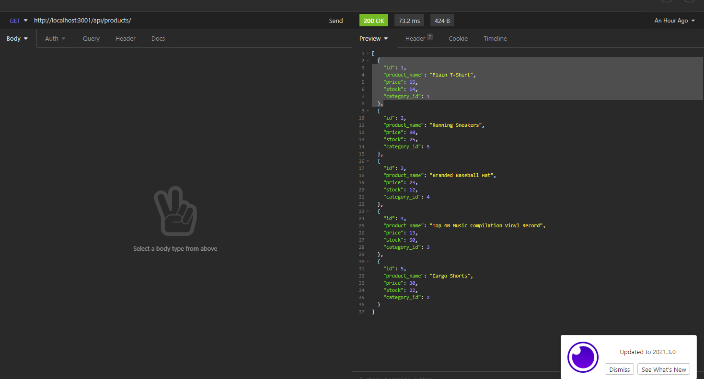

# ECommerce Back End

## Description

This is program exemplifies back-end data storage elements of an e-commerce platform. Using routes, the user 
can create, update, delete, and access the company's products, product tags, and product categories

### Technology Used

Node.js, Javascript, MySQL, Sequelize, Insomnia

### Visuals

### Links
Github Repository:
[githubRepository]  https://github.com/will98nicholson/ECommerce
Video Walkthough:
[videoWalkthough]  https://drive.google.com/file/d/17bW_-B7t_OvXonLwRtpXJDXBDpwo1wzJ/view